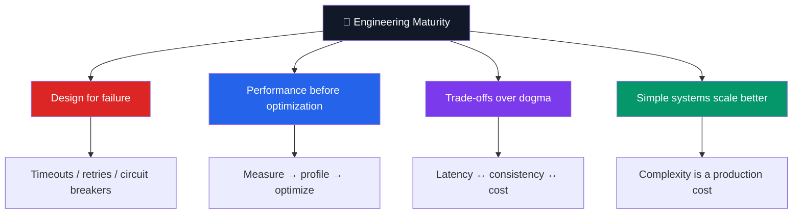

<div align="center">


<a href="https://github.com/SXHRYU">
  
  
</a>
<br/>

[](mailto:devmalcevv@gmail.com)

TODO: add 🥲<br>
[](https://linkedin.com/in/)

</div>

---

### 🧭 Navigation
[👋 About](#-about) · [🛠️ Technologies](#️-stack) · [🗺️ Roadmap](#️-roadmap)

---


<div align="center">  </div>

```go
package main

type Developer struct {
	Name     string
	Role     string
	Focus    []string
	Stack    Stack
	Learning []string
}

type Stack struct {
	Languages []string
	Backend   []string
	Databases []string
	DevOps    []string
	Testing   []string
}

func main() {
	me := Developer{
		Name:     "Maltsev Vyacheslav",
		Role:     "Go Backend / Systems Engineer",

		Focus: []string{
			"⚡ High RPS REST/gRPC applications",
			"🧩 Microservices & Event-Driven",
			"🐳 Cloud-native: Docker, Kubernetes, CI/CD",
			"🧵 Multiprocessing: goroutines, channels, context",
		},

		Stack: Stack{
			Languages: []string{"Go", "SQL", "Python", "C++", "Bash"},
			Backend:   []string{"net/http", "gRPC", "Kafka", "gateways"},
			Databases: []string{"PostgreSQL", "Redis", "ClickHouse", "SQLite"},
			DevOps:    []string{"Docker", "Kubernetes", "GitHub Actions + GitLab CI", "Prometheus + Grafana"},
			Testing:   []string{"testify", "gomock", "table-driven tests"},
		},

		Learning: []string{"C++", "Product Engineering", "AI improvements"},
	}

	println("Simple. Tested. Concurrent. Production-ready.")
	_ = me
}
```

---


<div align="center">

**Languages**

*proficient*


*knowledgeable*


**Databases and queues**


**Infrastructure**


<br>


<br>


<br>


**Tools**


</div>

---




---

<div align="center">

### 🌟 *"Always code as if the guy who ends up maintaining your code will be a violent psychopath who knows where you live."*

TODO: add 🥲<br>
**⭐️ [Your Golang/Python Developer](https://linkedin.com) ⭐️**


</div>
